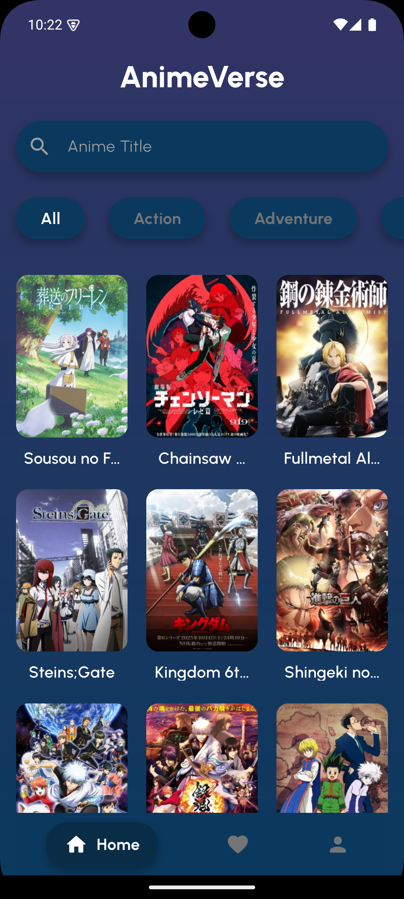
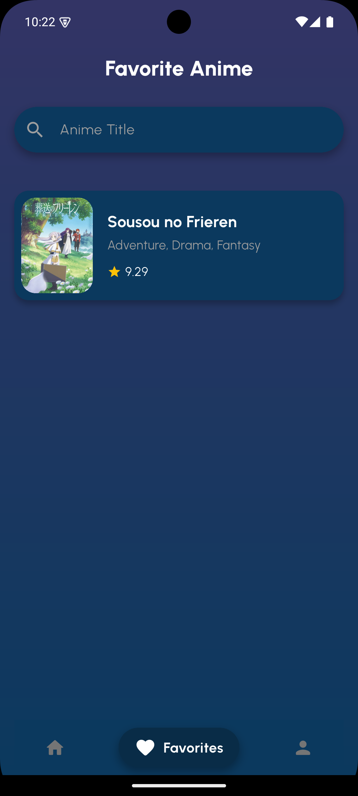
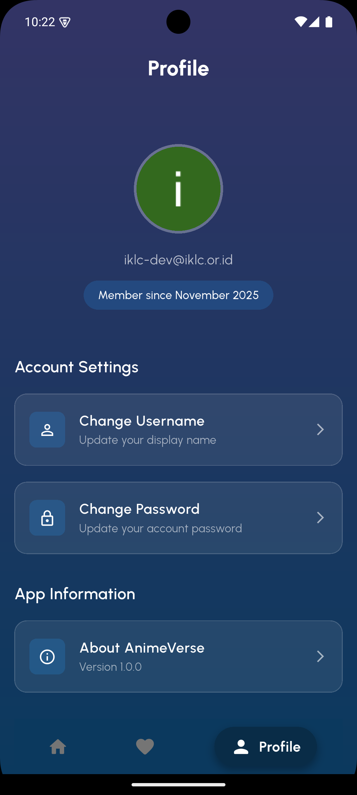

# 🎌 Anime Verse

<div align="center">


**A modern anime discovery and tracking application built with Flutter**

*Created for IKLC Mobile Programming Teaching Session*

[Features](#-features) • [Screenshots](#-screenshots) • [Setup](#-getting-started) • [Architecture](#-architecture) • [Future Improvements](#-future-improvements)

</div>

---

## 📖 About

**Anime Verse** is an educational Flutter project developed for the **IKLC Mobile Programming** course. This application serves as a comprehensive teaching resource demonstrating modern Flutter development practices, Firebase integration, state management, and production-ready app deployment.

### Course Context

This project was built progressively across **8 teaching modules**:

| Module | Topic | Key Concepts |
|--------|-------|-------------|
| 1 | Basic Layouting | Flutter widgets, layout basics |
| 2 | Layout & Static UI | Complex layouts, custom widgets |
| 3 | Navigation | `go_router`, deep linking, route management |
| 4 | State Management | `Provider`, reactive programming |
| 5 | Consuming API | HTTP requests, JSON parsing, Jikan API integration |
| 6 | Firebase Auth | Google Sign-In, authentication flows |
| 7 | Firestore | Cloud database, CRUD operations, real-time updates |
| 8 | Build & Release | App signing, CI/CD, production deployment |

---

## ✨ Features

### 🎯 Core Features

- **✅ Anime Discovery**: Browse popular and trending anime using the Jikan API (MyAnimeList unofficial API)
- **✅ Detailed Information**: View comprehensive anime details including synopsis, ratings, genres, and more
- **✅ User Authentication**: Secure Google Sign-In integration via Firebase Authentication
- **✅ Favorites Management**: Save and manage favorite anime in real-time using Cloud Firestore
- **✅ User Profiles**: View and manage user information
- **✅ Offline Caching**: Cached network images for improved performance
- **✅ Responsive UI**: Beautiful, modern interface with SVG support
- **✅ Production Ready**: Release signing, CI/CD with GitHub Actions

### 🔐 Security

- **Production Firestore Rules**: User-scoped data access with authentication
- **Secure Authentication**: Firebase Authentication with Google Sign-In
- **Release Signing**: Production keystore for Play Store deployment

---

## 📱 Screenshots

<table>
  <tr>
    <td><br/><b>Sign In</b></td>
    <td><br/><b>Sign Up</b></td>
    <td><br/><b>Home</b></td>
  </tr>
  <tr>
    <td><br/><b>Anime Detail</b></td>
    <td><br/><b>Favorites</b></td>
    <td><br/><b>Profile</b></td>
  </tr>
</table>

---

## 🚀 Getting Started

### Prerequisites

- **Flutter SDK**: 3.38.1 or higher
- **Dart SDK**: 3.10.0 or higher
- **Android Studio** or **VS Code** with Flutter extensions
- **Java JDK**: 17 (for Android builds)
- **Firebase Account**: For authentication and database

### Installation

1. **Clone the repository**
   ```bash
   git clone https://github.com/RivaldoPardede/IKLC-anime-verse.git
   cd IKLC-anime-verse
   ```

2. **Install dependencies**
   ```bash
   flutter pub get
   ```

3. **Firebase Setup**
   
   a. Create a Firebase project at [Firebase Console](https://console.firebase.google.com/)
   
   b. Add an Android app to your Firebase project
   
   c. Download `google-services.json` and place it in `android/app/`
   
   d. Enable **Authentication** → **Google Sign-In**
   
   e. Create a **Firestore Database** (start in production mode)
   
   f. Deploy Firestore security rules from `firestore.rules`

4. **Configure Firebase SHA Keys**
   
   Get your debug SHA-1:
   ```bash
   cd android
   ./gradlew signingReport
   ```
   
   Add the SHA-1 and SHA-256 to Firebase Console → Project Settings → Your Android App

5. **Run the app**
   ```bash
   flutter run
   ```

### Building for Production

1. **Generate Release Keystore** (first time only)
   ```bash
   keytool -genkey -v -keystore android/app/upload-keystore.jks -keyalg RSA -keysize 2048 -validity 10000 -alias upload
   ```

2. **Create `android/key.properties`**
   ```properties
   storePassword=YOUR_PASSWORD
   keyPassword=YOUR_KEY_PASSWORD
   keyAlias=upload
   storeFile=upload-keystore.jks
   ```

3. **Build Release APK**
   ```bash
   flutter build apk --release
   ```

---

## 🏗️ Architecture

### Project Structure

```
lib/
├── config/           # Navigation Logic
│   ├── routes.dart
├── models/           # Data models
│   ├── anime.dart
├── repositories/          
│   ├── anime_repository.dart
├── provider/        # Providers
│   ├── app_state_provider.dart
│   ├── auth_provider.dart
├── screens/          # UI screens
│   ├── home_screen.dart
│   ├── detail_screen.dart
│   ├── favorite_screen.dart
│   ├── profile_screen.dart
│   ├── signin_screen.dart
│   └── signup_screen.dart
├── services/         # Business logic
│   ├── auth/ 
│       ├── auth_service.dart  # Firebase Authentication
│   └── firestore_service.dart   # Firestore operations
├── widgets/          # Reusable components
└── main.dart         # App entry point
```

### Tech Stack

**Frontend:**
- Flutter & Dart
- Provider (State Management)
- go_router (Navigation)
- cached_network_image (Image caching)
- flutter_svg (SVG support)

**Backend & Services:**
- Firebase Authentication (Google Sign-In)
- Cloud Firestore (Database)
- Jikan API (MyAnimeList data)

**Development & Deployment:**
- GitHub Actions (CI/CD)
- Flutter build tools
- Android SDK & NDK

---

## 📝 API Reference

This project uses the [Jikan API](https://jikan.moe/) - an unofficial MyAnimeList API.

**Base URL:** `https://api.jikan.moe/v4`

**Key Endpoints Used:**
- `GET /top/anime` - Get top anime
- `GET /anime/{id}` - Get anime details
- `GET /anime/{id}/full` - Get full anime information

**Rate Limits:**
- 60 requests per minute
- 3 requests per second

---

## 🔮 Future Improvements

The following features are planned or suggested for enhancement:

### 🎯 High Priority

- [ ] **Search Functionality**
  - Add anime search by title
  - Filter by genre, year, type
  - Search history

- [ ] **Enhanced Profile Features**
  - ⚠️ Change username functionality (TODO in `profile_screen.dart:378`)
  - Profile picture upload
  - User statistics (total favorites, etc.)

- [ ] **App Branding**
  - ⚠️ Add custom logo to auth screens (TODO in `signin_screen.dart:188`, `signup_screen.dart:128`)
  - Improve splash screen with logo animation

- [ ] **About Section**
  - ⚠️ Implement "About App" screen (TODO in `profile_screen.dart:439`)
  - Add version information
  - Credits and attributions

### 🎨 UI/UX Enhancements

- [ ] **Dark Mode**
  - Implement theme switching
  - Save user preference

- [ ] **Improved Animations**
  - Page transitions
  - Loading states
  - Micro-interactions

- [ ] **Accessibility**
  - Screen reader support
  - Larger text options
  - Color contrast improvements

### 🚀 Advanced Features

- [ ] **Anime Lists**
  - Watch later list
  - Currently watching
  - Completed anime
  - Custom lists

- [ ] **Social Features**
  - Share favorites with friends
  - Anime recommendations
  - User reviews and ratings

- [ ] **Notifications**
  - New episode alerts
  - Season reminders
  - Favorites updates

- [ ] **Offline Mode**
  - Cache anime details
  - Offline favorites viewing
  - Sync when online

### 🔧 Technical Improvements

- [ ] **Testing**
  - Unit tests for services
  - Widget tests for screens
  - Integration tests

- [ ] **Performance**
  - Implement pagination for anime lists
  - Optimize image loading
  - Reduce app size

- [ ] **Error Handling**
  - Better error messages
  - Retry mechanisms
  - Network error handling

- [ ] **Analytics**
  - Firebase Analytics integration
  - User behavior tracking
  - Crash reporting

---

## 🔐 Security & Privacy

### Firestore Security Rules

The app uses production-ready Firestore security rules:

```javascript
service cloud.firestore {
  match /databases/{database}/documents {
    match /users/{userId} {
      allow read, write: if request.auth != null && request.auth.uid == userId;
      
      match /favorites/{animeId} {
        allow read, write: if request.auth != null && request.auth.uid == userId;
      }
    }
  }
}
```

**Key Security Features:**
- ✅ User authentication required
- ✅ User-scoped data access
- ✅ No public read/write access
- ✅ Secure by default

### Privacy

- User data is stored securely in Firebase
- No personal information is collected beyond Google Sign-In profile
- Favorites are private and user-specific
- No third-party analytics or tracking

---

## 🤝 Contributing

This is an educational project, but contributions are welcome! If you'd like to improve the code or add features:

1. Fork the repository
2. Create a feature branch (`git checkout -b feature/amazing-feature`)
3. Commit your changes (`git commit -m 'Add amazing feature'`)
4. Push to the branch (`git push origin feature/amazing-feature`)
5. Open a Pull Request

### For Students

If you're a student using this as a base for your project:

1. **Fork the repository** to your own GitHub account
2. **Implement missing features** from the TODO list
3. **Add your own creativity** - make it unique!
4. **Document your changes** in your README
5. **Share your work** - add screenshots and demos

---

## 📄 License

This project is licensed under the MIT License - see the [LICENSE](LICENSE) file for details.

---

## 🙏 Acknowledgments

### APIs & Services

- **[Jikan API](https://jikan.moe/)** - MyAnimeList unofficial API
- **[Firebase](https://firebase.google.com/)** - Authentication and database
- **[Flutter](https://flutter.dev/)** - UI framework

### Teaching Resources

- **IKLC Mobile Programming Course** - For the comprehensive curriculum
- **Flutter Documentation** - Extensive learning resources
- **Firebase Documentation** - Integration guides

### Packages Used

Special thanks to the maintainers of:
- `provider` - State management
- `go_router` - Routing solution
- `cached_network_image` - Image caching
- `flutter_svg` - SVG support
- `http` - HTTP client
- And all other dependencies

---

## 📧 Contact & Support

### For Students

If you're taking the IKLC Mobile Programming course and have questions:
- Check the course materials first
- Review the module-specific documentation
- Ask in class or office hours

### For Developers

If you're using this as a learning resource:
- Star ⭐ the repository if you find it helpful
- Report issues via GitHub Issues
- Fork and improve!

---

## 🎓 Learning Resources

### Flutter

- [Official Flutter Documentation](https://docs.flutter.dev/)
- [Flutter Cookbook](https://docs.flutter.dev/cookbook)
- [Dart Language Tour](https://dart.dev/guides/language/language-tour)

### Firebase

- [Firebase Flutter Setup](https://firebase.google.com/docs/flutter/setup)
- [Firebase Authentication](https://firebase.google.com/docs/auth)
- [Cloud Firestore](https://firebase.google.com/docs/firestore)

### State Management

- [Provider Package](https://pub.dev/packages/provider)
- [Flutter State Management Options](https://docs.flutter.dev/data-and-backend/state-mgmt/options)

---

<div align="center">

**Made with ❤️ for IKLC Mobile Programming**

*Happy Coding! 🚀*

</div>